<!--
  README DE PERFIL DE GITHUB - ESTILO BENTO Y LINEAR
  Diseñado para: Jorge Ismael Doicela Molina

  Nota: Para personalizar tus enlaces de contacto, edita las URLs en las líneas de abajo.
-->

  <strong>Español</strong> | <a href="README.en.md">English</a>

  # Jorge Ismael Doicela Molina
  ### **Desarrollador de Software con enfoque en DevSecOps**
  *Ingeniería en Inteligencia Artificial y Ciberseguridad (En progreso)*

  **Conéctate conmigo:**

  
  
  
  

 

---

## Sobre Mí

Desarrollador de software radicado en Quito, Ecuador, y guiado por valores cristianos. Me apasiona el desarrollo de sistemas web, aplicaciones nativas y multiplataforma, así como la administración de servidores (locales y cloud), con un enfoque orientado a soluciones integrales, arquitecturas escalables, seguridad e **Infraestructura como Código (IaC)**.

Mi experiencia abarca el desarrollo **Full-Stack**, trabajando con tecnologías frontend y backend como **React**, **Next.js**, **NestJS**, **Laravel / Blade** y **.NET**, lenguajes de programación como **PHP**, **C#**, **Python**, **C** y **C++**, además de bases de datos relacionales (**PostgreSQL** y **MySQL**) y no relacionales (**MongoDB**). Integro prácticas de **DevSecOps** y principios de diseño seguro desde el inicio del ciclo de desarrollo. En paralelo, expando mis conocimientos cursando la Ingeniería en **Inteligencia Artificial y Ciberseguridad**, lo que me permite aplicar un enfoque de hardening a los sistemas que diseño.

Con una marcada sensibilidad por la estética visual y un gran interés por el diseño limpio y minimalista, disfruto la aplicación de diferentes estilos de diseño (como el **Linear Look** y distribuciones **Bento Grid**), maquetados previamente en Figma para asegurar una experiencia de usuario moderna, intuitiva y sumamente pulida.

---

## Perfil Profesional (Diseño Bento Grid)

<table width="100%">
  <!-- Fila 1: Stack Principal y Workflow -->
  <tr>
    <td width="50%" valign="top">
      <h3>Tecnologías y Stack Principal</h3>
      
Tecnologías clave en las que confío para crear e iterar productos:

       
      
      
      
      
       
      
      
      
      
       
      
      
      
      
       
      
      
      
      
      
      
        
      
<small>Enfoque en desarrollo backend eficiente, persistencia relacional y no relacional, y empaquetamiento contenedorizado.</small>

    </td>
    <td width="50%" valign="top">
      <h3>Flujo de Trabajo y Entorno de Terminal</h3>
      
Entornos optimizados y configurados para máxima productividad y velocidad:

       
      
      
      
      
       
      
      
      
        
      
<b>Sioyek:</b> Lector de PDFs técnicos enfocado en navegación ágil por teclado para agilizar el estudio académico y técnico.

    </td>
  </tr>

  <!-- Fila 2: Experiencia y Educación -->
  <tr>
    <td width="50%" valign="top">
      <h3>Experiencia Reciente</h3>
      <ul>
        <li>
          <b>Emplifi</b>
           
          <small>Desarrollo Full-Stack y optimización de APIs para el sistema de gestión de recursos humanos, mejorando el rendimiento y la persistencia de datos.</small>
        </li>
         
        <li>
          <b>Plataforma de Capacitaciones (CNC)</b>
           
          <small>Estabilización de código, desarrollo de módulos backend y despliegue contenedorizado con Docker para el Consejo Nacional de Competencias.</small>
        </li>
      </ul>
    </td>
    <td width="50%" valign="top">
      <h3>Educación</h3>
      <ul>
        <li>
          <b>Ingeniería en Inteligencia Artificial y Ciberseguridad</b>
           
          <small>Universidad Bolivariana del Ecuador (Estudiante actual)</small>
        </li>
         
        <li>
          <b>Tecnólogo Superior en Desarrollo de Software</b>
           
          <small>Tecnológico Traversari (Graduado)</small>
        </li>
      </ul>
    </td>
  </tr>

  <!-- Fila 3: Cloud & DevSecOps -->
  <tr>
    <td colspan="2" valign="top">
      <h3>Nube, DevSecOps y Ciberseguridad</h3>
      <strong>Infraestructura en la Nube</strong>
      
<small>Despliegue de arquitecturas en la nube mediante servicios de Amazon Web Services (AWS) como Lightsail para mantener servidores VPS de alto rendimiento.</small>

       
      <strong>Automatización y CI/CD</strong>
      
<small>Integración de pipelines de despliegue continuo (CI/CD) con herramientas como **GitHub Actions**, dirigidos de forma automatizada hacia VPS y servidores cloud.</small>

       
      <strong>Ciberseguridad y Arquitectura</strong>
      
<small>Integración de prácticas DevSecOps desde el diseño inicial, asegurando el empaquetado seguro en Docker y mitigando riesgos de seguridad a nivel de arquitectura.</small>

    </td>
  </tr>
</table>

---

## Estadísticas de GitHub

  
  &nbsp;&nbsp;
  

