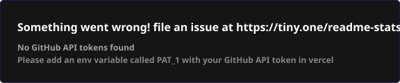

<!--
  README DE PERFIL DE GITHUB - ESTILO BENTO Y LINEAR
  Diseñado para: Jorge Ismael Doicela Molina

  Nota: Para personalizar tus enlaces de contacto, edita las URLs en las líneas de abajo.
-->

  # Jorge Ismael Doicela Molina
  ### **Desarrollador de Software y DevSecOps**
  *Estudiante de Ingeniería en Inteligencia Artificial y Ciberseguridad*

  **Conéctate conmigo:**

  
  
  

 

---

## Sobre Mí

Desarrollador de software de **23 años** radicado en Quito, Ecuador. Me apasiona construir herramientas robustas, eficientes y seguras, con un enfoque particular en arquitecturas orientadas al modelo de **Software como Servicio (SaaS)**.

Actualmente divido mi tiempo entre el desarrollo **Full-Stack** (con especialización en el ecosistema **PERN**) y mis estudios de Ingeniería en **Inteligencia Artificial y Ciberseguridad**. Esto me permite integrar desde el inicio del ciclo de desarrollo prácticas avanzadas de **DevSecOps** y principios de diseño seguro.

Tengo un gran interés por la estética minimalista y moderna, en especial el **Linear Look** y las distribuciones **Bento Grid**, las cuales diseño en Figma antes de llevarlas al código para asegurar una experiencia de usuario sumamente pulida.

---

## Perfil Profesional (Diseño Bento Grid)

<table width="100%">
  <!-- Fila 1: Stack Principal y Workflow -->
  <tr>
    <td width="50%" valign="top">
      <h3>Tecnologías y Stack Principal</h3>
      
Tecnologías clave en las que confío para crear e iterar productos:

       
      
      
      
      
       
      
      
      
        
      
<small>Enfoque en desarrollo backend eficiente, persistencia relacional estructurada, y empaquetamiento contenedorizado.</small>

    </td>
    <td width="50%" valign="top">
      <h3>Flujo de Trabajo y Entorno de Terminal</h3>
      
Entornos optimizados y configurados para máxima productividad y velocidad:

       
      
      
      
      
       
      
      
      
        
      
<b>Sioyek:</b> Lector de PDFs técnicos enfocado en navegación ágil por teclado para agilizar el estudio académico y técnico.

    </td>
  </tr>

  <!-- Fila 2: Experiencia y Educación -->
  <tr>
    <td width="50%" valign="top">
      <h3>Experiencia Reciente</h3>
      <ul>
        <li>
          <b>Emplifi</b>
           
          <small>Sistema de gestión de recursos humanos orientado a la optimización de procesos del personal administrativo.</small>
        </li>
         
        <li>
          <b>Plataforma de Capacitaciones</b>
           
          <small>Desarrollo, estabilización y despliegue contenedorizado para el Consejo Nacional de Competencias (CNC).</small>
        </li>
      </ul>
    </td>
    <td width="50%" valign="top">
      <h3>Educación</h3>
      <ul>
        <li>
          <b>Ingeniería en Inteligencia Artificial y Ciberseguridad</b>
           
          <small>Universidad Bolivariana del Ecuador (Estudiante actual)</small>
        </li>
         
        <li>
          <b>Tecnólogo Superior en Desarrollo de Software</b>
           
          <small>Tecnológico Traversari (Graduado)</small>
        </li>
      </ul>
    </td>
  </tr>

  <!-- Fila 3: Cloud & DevSecOps -->
  <tr>
    <td colspan="2" valign="top">
      <h3>Nube, DevSecOps y Ciberseguridad</h3>
      <strong>Infraestructura en la Nube</strong>
      
<small>Despliegue de arquitecturas en la nube mediante servicios de Amazon Web Services (AWS) como Lightsail para mantener servidores VPS de alto rendimiento.</small>

       
      <strong>Automatización y CI/CD</strong>
      
<small>Integración de pipelines de despliegue continuo (Continuous Integration / Continuous Deployment) dirigidos de forma automatizada hacia VPS y servidores cloud.</small>

       
      <strong>Ciberseguridad y Arquitectura</strong>
      
<small>Integración de prácticas DevSecOps desde el diseño inicial, asegurando el empaquetado seguro en Docker y mitigando riesgos de seguridad a nivel de arquitectura.</small>

    </td>
  </tr>
</table>

---

## Estadísticas de GitHub

  
  &nbsp;&nbsp;
  

